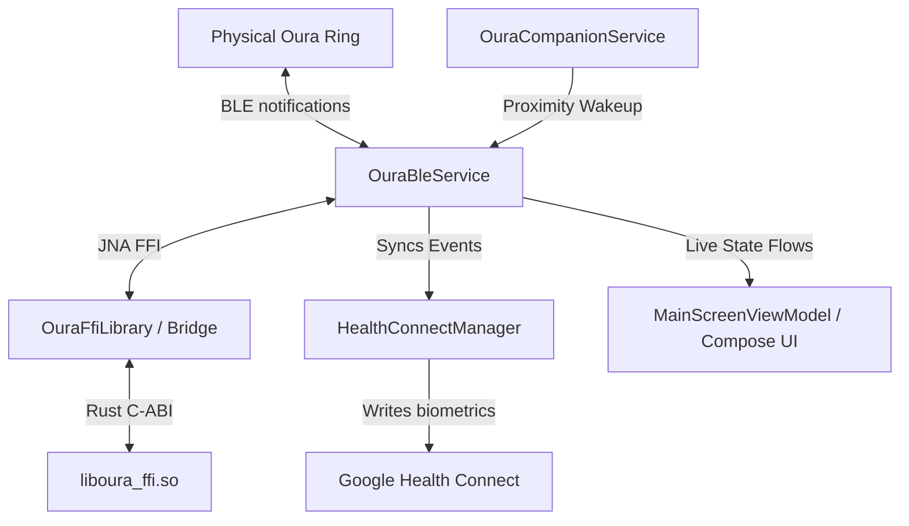

# Software Design Document: open_oura Android Bridge

This document details the software architecture, design decisions, and system constraints implemented for the local-first, headless sync infrastructure connecting Android to an Oura Ring (Gen 3/4/5).

---

## 1. System Architecture Overview

The system bridges a high-performance, stateless Rust core (`oura-protocol` / `oura-ffi`) to an Android application layer via Java Native Access (JNA), prioritizing memory safety, edge power efficiency under Android 16 limitations, and temporal alignment accuracy.



To simplify lifecycle management and eliminate concurrency bugs, **no asynchronous operations cross the FFI boundary**:
1. All network, scheduling, and BLE transport routines are implemented natively in Kotlin.
2. The Rust library acts as a pure, synchronous decoder and cryptor.

---

## 2. Memory Safety & The JNA FFI Bridge

To prevent native heap leaks, the C-ABI boundary utilizes a strict allocation and deallocation pattern. 

### 2.1 Ownership and Freeing Pattern
Functions returning variable-length strings (e.g. `oura_decode_event`, `oura_event_name`, and `oura_pop_diagnostic`) dynamically allocate a null-terminated `CString` on the Rust heap and return it as a raw `*mut c_char` pointer. The caller owns this pointer and must free it.

Kotlin's JNA mapper (`OuraFfiLibrary`) maps these return types to JNA `Pointer?`. The wrapper class `OuraFfiBridge` guarantees deallocation by reading the string and calling `oura_string_free` inside a `finally` block:

```kotlin
fun decodeEvent(tag: Byte, body: ByteArray): String? {
    var ptr: Pointer? = null
    return try {
        ptr = OuraFfiLibrary.INSTANCE.oura_decode_event(tag, body, body.size.toLong())
        ptr?.getString(0, "UTF-8")
    } finally {
        ptr?.let { OuraFfiLibrary.INSTANCE.oura_string_free(it) }
    }
}
```

---

## 3. BLE Ingestion, Packet Reassembly & Live HR Flow

### 3.1 Packet Reassembly & Extended Framing
Incoming notification packets arriving over Bluetooth Low Energy (BLE) are structured using an extended 4-byte header: `[Tag, Type, LenMSB, LenLSB]`. 
*   **Tag:** 1 byte representing the event type.
*   **Type:** 1 byte representing payload classifications.
*   **Length:** 2 bytes (Big-Endian) representing payload size up to 65,535 bytes (allowing large data pages like Sleep summaries to sync efficiently).

`OuraBleService` accumulates notification fragments in `notificationBuffer` and processes complete packets:

```kotlin
notificationBuffer = notificationBuffer + packet
while (notificationBuffer.size >= 4) {
    val tag = notificationBuffer[0].toInt() and 0xFF
    val type = notificationBuffer[1].toInt() and 0xFF
    val payloadLength = (notificationBuffer[2].toInt() and 0xFF) or 
                        ((notificationBuffer[3].toInt() and 0xFF) shl 8)
    val totalExpectedFrameSize = payloadLength + 4
    if (notificationBuffer.size >= totalExpectedFrameSize) {
        val completeFrame = notificationBuffer.copyOfRange(0, totalExpectedFrameSize)
        notificationBuffer = notificationBuffer.copyOfRange(totalExpectedFrameSize, notificationBuffer.size)
        // Parse and handle packet...
    } else {
        break
    }
}
```

### 3.2 Daytime Live HR Activation (F-4.5)
To force the ring to actively collect and log daytime heart rate metrics, `OuraBleService` writes target GATT feature toggles right after authentication succeeds:
1. **Notification Subscription:** Write `SetNotification(0x3f)` to listen to heart rate update alerts.
2. **Feature Mode Setup:** Write `SetFeatureMode(FEATURE_DAYTIME_HR, FEATURE_MODE_CONNECTED_LIVE)` to put the wearable in active realtime logging mode.

---

## 4. NTP-Style Clock Drift Calibration

Because the ring has no active connection to GPS or network time, its internal oscillator drifts over time. If a user does not sync for multiple days, sample timestamps can mismatch reality by minutes.

### 4.1 Chronological Anchoring
To calibrate timestamps, `HealthConnectManager` scans the batch payload for `time_sync` (`0x42`) events.
* Each `time_sync` event contains the ring's decisecond tick counter paired with the absolute phone UTC timestamp at the moment of sync.
* Every subsequent Heart Rate and HRV sample is mapped to the nearest preceding `time_sync` anchor.

### 4.2 Precision Calculations
Offsets are calculated using millisecond-first arithmetic to prevent truncation errors and integer overflow:

$$\text{sampleTimeMillis} = (\text{timeSyncUnix} \times 1000) + ((\text{sampleDeciseconds} - \text{timeSyncDeciseconds}) \times 100)$$

If no `time_sync` anchor is available, the mapping defaults to anchoring the samples relative to the sync-completion timestamp.

---

## 5. Background Lifecycle & Battery Optimization

Running a continuous background BLE scanner drains battery and violates Android 16's strict background execution and Doze policies.

### 5.1 Companion Device Manager (CDM) Proximity Wakeups
* The user associates their Oura Ring using Android's system-managed Companion Device picker.
* The system monitors BLE advertisement beacons from the ring. When the ring is detected nearby, the OS wakes up `OuraCompanionService` in the background.
* `OuraCompanionService` reads saved pairing credentials from Keystore-backed `EncryptedSharedPreferences` and starts `OuraBleService` to perform a targeted sync.

### 5.2 Watchdog Execution Budget (45-second limits)
To guarantee the background service does not run indefinitely, `OuraBleService` enforces a strict **45-second execution budget**.
* A watchdog job is launched when a background sync begins.
* If the sync fails to complete, or the connection stalls, the watchdog forces a `disconnect()` and calls `stopSelf()`, releasing wake-locks and allowing the application to sleep.
* Partially synced metrics are committed to Health Connect incrementally during the sync batch loop. If the watchdog interrupts a massive backlog sync, the next wakeup naturally resumes from the last successfully synced cursor.

---

## 6. Realtime Observability & Diagnostics

To facilitate debugging without relying on logcat or USB connections, the app exposes native diagnostics to the user:

1. **Thread-Safe Log Queue:** A bounded `lazy_static` logging queue (`Mutex<VecDeque<String>>`) capped at 500 lines is implemented inside the Rust FFI library. FFI methods record operational events here.
2. **UI Monospace Log Console:** A periodic coroutine in `MainScreenViewModel` polls `popDiagnostic()` every 500ms, updating a Jetpack Compose state flow. These logs are rendered inside a scrollable dev-console card.
3. **Decoded Event History:** Successfully decoded biometric events are committed to a local file (`oura_history.json`) and displayed in a dashboard card showing the last 3 events with their human-readable tags and raw Unix timestamps.

---

## 7. Headless Target Compilation

To speed up local development builds and bypass multi-ABI cross-compilation overheads, compile for the physical device architecture exclusively:

```bash
# Targets the Pixel 10 Pro architecture directly (arm64-v8a)
.\gradlew.bat assembleDebug -Pandroid.injected.build.abi=arm64-v8a
```

---

## 8. State Sanitization & Desync Prevention

To prevent persistent background crash loops and state-machine oscillations:
1. **Case Normalization:** All MAC addresses retrieved from `SharedPreferences` or incoming Companion Device Manager associations are automatically normalized to uppercase using `.uppercase()` at all retrieval and storage entry points.
2. **State-Gating:** Auto-reconnection and post-rebirth recovery loops are strictly gated by `OuraBleService.connectionState` (requiring `ConnectionState.Idle`, or `Scanning` for the picker recovery block to prevent deadlocks). If a connection attempt transitions to `Failed`, the state machine halts further pairing and connection triggers until the user manually triggers a sync or resets pairing credentials.
3. **Persistent Handshake Alignment:** Instead of using volatile, in-memory pairing states (which are vulnerable to race conditions when UI recreation occurs during the Companion picker transition), the app persists the credentials immediately and tracks verification state via a `pairing_verified` storage flag. Upon service binding, if a pairing is present but unverified, the ViewModel forces a service reset and triggers the pairing sequence (`pairNewRing`) synchronously. Once authentication succeeds and the state reaches `Ready`, the `pairing_verified` flag is set, enabling subsequent auto-reconnection routines. To avoid race conditions, the UI flow collector synchronously pulls the absolute service state immediately upon channel connection, and the association trigger clears any residual scan states by forcing the local state flow to `Idle`.
