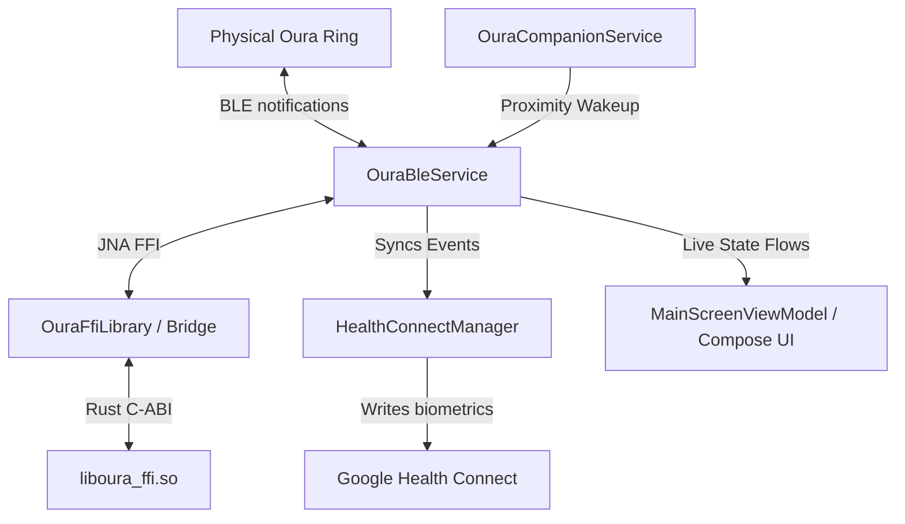

# Software Design Document: open_oura Android Bridge

This document details the software architecture, design decisions, and system constraints implemented for the local-first, headless sync infrastructure connecting Android to an Oura Ring (Gen 3/4/5).

---

## 1. System Architecture Overview

The system bridges a high-performance, stateless Rust core (`oura-protocol` / `oura-ffi`) to an Android application layer via Java Native Access (JNA), prioritizing memory safety, edge power efficiency under Android 16 limitations, and temporal alignment accuracy.



To simplify lifecycle management and eliminate concurrency bugs, **no asynchronous operations cross the FFI boundary**:
1. All network, scheduling, and BLE transport routines are implemented natively in Kotlin.
2. The Rust library acts as a pure, synchronous decoder and cryptor.

### 1.2 Subsystem Decomposition (Modular Architecture)
To scale beyond the MVP, the BLE management layer is decoupled into isolated subsystems:
*   **Transport Subsystem (`transport/`)**: `BleTransportEngine` manages the `BluetoothGatt` lifecycle and connection state transitions. It streams raw callbacks into the `PacketReassembler`, which reassembles native 2-byte packet buffers sequentially.
*   **Authentication Subsystem (`auth/`)**: `OuraAuthenticator` isolates cryptographic nonces, FFI encryption handshakes, and credential verification checks from raw Bluetooth callbacks. `CredentialStore` wraps keystore-backed preferences.
*   **Sync Subsystem (`sync/`)**: `HistorySyncManager` manages history sync loops and cursor tracking. It delegates clock drift offsets to `DriftCalibrator` and commits calibrated event records to `HealthConnectManager`.
*   **Controller Subsystem (`controller/`)**: `OuraController` exposes type-safe outbound commands (such as Live HR activation, Flight Mode, and Factory Reset), shielding the application from raw characteristic writes.
*   **Thin Coordinator (`OuraBleService.kt`)**: Focuses strictly on foreground service notification rules, CDM proximity bindings, and OS-level entry hooks.
*   **JNA Testability Wrapper**: The native JNA library is wrapped behind the `OuraFfiWrapper` interface to decouple upper application layers from host compilation constraints, enabling 100% JVM mock unit tests without native dynamic library loadings.

---

## 2. Memory Safety & The JNA FFI Bridge

To prevent native heap leaks, the C-ABI boundary utilizes a strict allocation and deallocation pattern. 

### 2.1 Ownership and Freeing Pattern
Functions returning variable-length strings (e.g. `oura_decode_event`, `oura_event_name`, and `oura_pop_diagnostic`) dynamically allocate a null-terminated `CString` on the Rust heap and return it as a raw `*mut c_char` pointer. The caller owns this pointer and must free it.

Kotlin's JNA mapper (`OuraFfiLibrary`) maps these return types to JNA `Pointer?`. The wrapper class `OuraFfiBridge` guarantees deallocation by reading the string and calling `oura_string_free` inside a `finally` block:

```kotlin
fun decodeEvent(tag: Byte, body: ByteArray): String? {
    var ptr: Pointer? = null
    return try {
        ptr = OuraFfiLibrary.INSTANCE.oura_decode_event(tag, body, body.size.toLong())
        ptr?.getString(0, "UTF-8")
    } finally {
        ptr?.let { OuraFfiLibrary.INSTANCE.oura_string_free(it) }
    }
}
```

---

## 3. BLE Ingestion, Packet Reassembly & Live HR Flow

### 3.1 Packet Reassembly & Native Framing
Incoming notification packets arriving over Bluetooth Low Energy (BLE) are structured using a native 2-byte header: `[Tag, Length]`. 
*   **Tag:** 1 byte representing the event type.
*   **Length:** 1 byte representing payload size (up to 255 bytes). The parser (`Packet.parse`) performs strict validation, returning `null` if the buffer size is less than `2 + len` to fail-fast on incomplete frames and avoid silent data corruption.

`OuraBleService` accumulates notification fragments in `notificationBuffer` and processes complete packets sequentially:

```kotlin
notificationBuffer += data
while (notificationBuffer.size >= 2) {
    val tag = notificationBuffer[0]
    val len = notificationBuffer[1].toInt() and 0xff
    val totalExpected = 2 + len

    if (notificationBuffer.size >= totalExpected) {
        val fullPacketBytes = notificationBuffer.copyOfRange(0, totalExpected)
        notificationBuffer = notificationBuffer.copyOfRange(totalExpected, notificationBuffer.size)

        val packet = Packet.parse(fullPacketBytes)
        // Parse and handle packet...
    } else {
        break
    }
}
```

### 3.2 Daytime Live HR Activation & Extended Tag Ingestion (F-4.5, F-2.12)
To force the ring to actively collect and log daytime heart rate metrics, `OuraBleService` writes target GATT feature toggles right after authentication succeeds:
1. **Notification Subscription:** Write `SetNotification(0x3f)` to listen to heart rate update alerts.
2. **Feature Mode Setup:** Write `SetFeatureMode(FEATURE_DAYTIME_HR, FEATURE_MODE_CONNECTED_LIVE)` to put the wearable in active realtime logging mode.

#### Biometric Data Ingestion Tags
To prevent data loss on newer ring models, `HealthConnectManager` must ingest heart rate and HRV samples from multiple biometric data tags decoded by the Rust core, including:
*   `0x80` (`green_ibi_quality_event`) - Raw green-LED daytime HR.
*   `0x60` (`ibi_and_amplitude_event`) - Classic infrared daytime HR.
*   `0x5d` (`hrv_event`) - 5-minute averaged night heart rate and HRV.
*   `0x55` (`sleep_heart_rate`) - Sleep heart rate records.
*   `0x71` (`green_ibi_and_amplitude_event`) - Combined green LED HR.
*   `0x6e` (`spo2_ibi_and_amplitude_event`) - SpO2 heart rate metrics.

---

## 4. NTP-Style Clock Drift Calibration

Because the ring has no active connection to GPS or network time, its internal oscillator drifts over time. If a user does not sync for multiple days, sample timestamps can mismatch reality by minutes.

### 4.1 Chronological Anchoring
To calibrate timestamps, `HealthConnectManager` scans the batch payload for `time_sync` (`0x42`) events.
* Each `time_sync` event contains the ring's decisecond tick counter paired with the absolute phone UTC timestamp at the moment of sync.
* Every subsequent Heart Rate and HRV sample is mapped to the nearest preceding `time_sync` anchor.

### 4.2 Precision Calculations
Offsets are calculated using millisecond-first arithmetic to prevent truncation errors and integer overflow:

$$\text{sampleTimeMillis} = (\text{timeSyncUnix} \times 1000) + ((\text{sampleDeciseconds} - \text{timeSyncDeciseconds}) \times 100)$$

If no `time_sync` anchor is available, the mapping defaults to anchoring the samples relative to the sync-completion timestamp.

---

## 5. Background Lifecycle & Battery Optimization

Running a continuous background BLE scanner drains battery and violates Android 16's strict background execution and Doze policies.

### 5.1 Companion Device Manager (CDM) Proximity Wakeups
* The user associates their Oura Ring using Android's system-managed Companion Device picker.
* The system monitors BLE advertisement beacons from the ring. When the ring is detected nearby, the OS wakes up `OuraCompanionService` in the background.
* `OuraCompanionService` reads saved pairing credentials from Keystore-backed `EncryptedSharedPreferences` and starts `OuraBleService` to perform a targeted sync.

### 5.2 Watchdog Execution Budget (45-second limits)
To guarantee the background service does not run indefinitely, `OuraBleService` enforces a strict **45-second execution budget**.
* A watchdog job is launched when a background sync begins.
* If the sync fails to complete, or the connection stalls, the watchdog forces a `disconnect()` and calls `stopSelf()`, releasing wake-locks and allowing the application to sleep.
* Partially synced metrics are committed to Health Connect incrementally during the sync batch loop. If the watchdog interrupts a massive backlog sync, the next wakeup naturally resumes from the last successfully synced cursor.

---

## 6. Realtime Observability & Diagnostics

To facilitate debugging without relying on logcat or USB connections, the app exposes native diagnostics to the user:

1. **Thread-Safe Log Queue:** A bounded `lazy_static` logging queue (`Mutex<VecDeque<String>>`) capped at 500 lines is implemented inside the Rust FFI library. FFI methods record operational events here.
2. **Bulk Log Drainage:** A periodic coroutine in `MainScreenViewModel` invokes `oura_drain_diagnostics()` every 500ms, retrieving a bulk JSON-serialized array of all accumulated logs in a single FFI call. This eliminates lock-contention overhead on the native mutex and prevents queue overflow during data sync bursts.
3. **Decoded Event History & UI Filtering (F-2.11):** Successfully decoded biometric events are committed to a local file (`oura_history.json`). The dashboard displays the most recent 3 decoded events. To prevent diagnostic telemetry packets from pushing user health summaries out of view, system tags `0x43` (`debug_event`) and `0x61` (`debug_data`) are explicitly filtered out from the Compose history card.

---

## 7. Headless Target Compilation

To speed up local development builds and bypass multi-ABI cross-compilation overheads, compile for the physical device architecture exclusively:

```bash
# Targets the Pixel 10 Pro architecture directly (arm64-v8a)
.\gradlew.bat assembleDebug -Pandroid.injected.build.abi=arm64-v8a
```

---

## 8. State Sanitization & Desync Prevention

To prevent persistent background crash loops and state-machine oscillations:
1. **Case Normalization:** All MAC addresses retrieved from `SharedPreferences` or incoming Companion Device Manager associations are automatically normalized to uppercase using `.uppercase()` at all retrieval and storage entry points.
2. **State-Gating:** Auto-reconnection and post-rebirth recovery loops are strictly gated by `OuraBleService.connectionState` (requiring `ConnectionState.Idle`, or `Scanning` for the picker recovery block to prevent deadlocks). If a connection attempt transitions to `Failed`, the state machine halts further pairing and connection triggers until the user manually triggers a sync or resets pairing credentials.
3. **Persistent Handshake Alignment & Handshake Fallback (F-2.13, F-2.14):** Instead of using volatile, in-memory pairing states (which are vulnerable to race conditions when UI recreation occurs during the Companion picker transition), the app persists the credentials immediately and tracks verification state via a `pairing_verified` storage flag. Upon service binding, if a pairing is present but unverified, the ViewModel forces a service reset and triggers the pairing sequence (`pairNewRing`) synchronously. Once authentication succeeds and the state reaches `Ready`, the `pairing_verified` flag is set, enabling subsequent auto-reconnection routines. To avoid race conditions, the UI flow collector synchronously pulls the absolute service state immediately upon channel connection (`onServiceConnected` in the ViewModel), and the association trigger clears any residual scan states by forcing the local state flow to `Idle`. If the user attempts pairing with a ring that already has an active cryptographic key (so command `0x24` / `SetAuthKey` times out or is ignored), `runSetupFlow` automatically falls back to standard `0x2f` challenge-response authentication.
4. **Deduplicated Data Stream:** The app processes incoming Bluetooth data strictly through single, unified GATT characteristic notification pathways. Redundant callback registrations are pruned to prevent ghost duplicate packets from corrupting the sequential queue.
5. **Pairing Retry Limits:** To prevent infinite background loops during a key desynchronization event or handshake rejection, the `MainScreenViewModel` tracks a `pairingAttemptCount` (reset to `0` upon reaching `Ready`). Auto-recovery and retry attempts are capped at a maximum of `3` failures, after which the app stands down to a permanent `Failed` state until a user manually restarts scanning.
